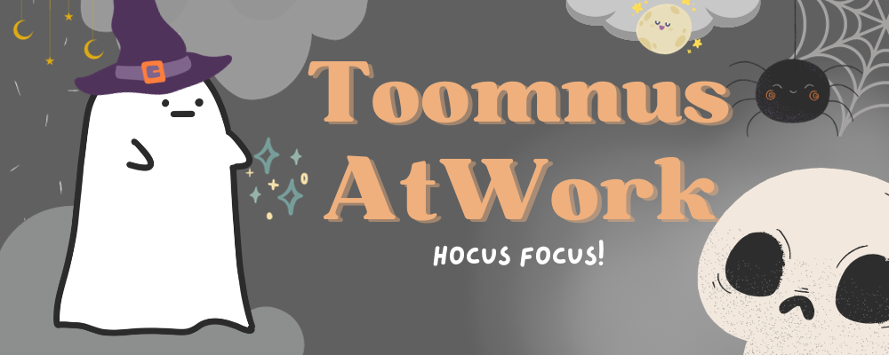

# Hi! I am [Peranut Toomnus](https://toomnusatwork.github.io/toomnus.github.io/) 🙌🏻

    

### About
- 🏫 I study at **Silpakorn University**.
- 📝 Typo often come from me lol.
- 🧑🏽‍💻 I'm currently learning **PHP** and **Javascript**.
- 🗿 I don't use arch btw **(yet)**.
- 🙇🏻‍♂️ **(But):** I will surely fix code and organize it.

### Language:

